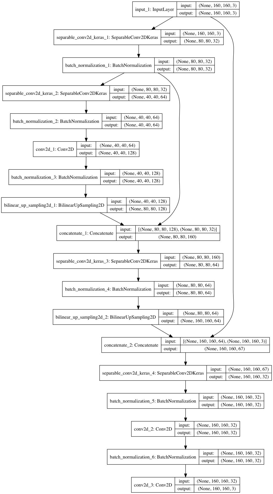

# Project: Follow Me

- [Project Rubric](https://review.udacity.com/#!/rubrics/1155/view)

## Writeup

### 1. Provide a write-up / README document including all rubric items addressed in a clear and concise manner. The document can be submitted either in either Markdown or a PDF format.

You're reading it!

### 2. The write-up conveys the an understanding of the network architecture.

>The student clearly explains each layer of the network architecture and the role that it plays in the overall network.

My Network has the following component.

- encoder network: extract abstract (global) features and context.
- 1x1 conv network: add nonlinearity to the features.
- decoder network: generate semantic map using features.

>The student can demonstrate the benefits and/or drawbacks different network architectures pertaining to this project and can justify the current network with factual data.

`Neural Network with fully connected layers` is usually used in Object Recognition Problem (Class Label Classification). A fully connected layer need a fixed size of input. On the otherhand, fully connected layer can be replaced by 1x1 convolution layer. `Neural Network without fully connected layers` a.k.a. `Fully Convolutional Network(FCN)` (replaced by 1x1 convolution layer) can take variable input size and more effective to operate on the GPU.

>Any choice of configurable parameters should also be explained in the network architecture.

I have trained 2layer FCN with skip connection.
Because Loss Curve is slightly overfitting, I think adding more layer is not good choice. The `number of channels` and `stride size` for each layer is choosed as convention.

>The student shall also provide a graph, table, diagram, illustration or figure for the overall network to serve as a reference for the reviewer.



### 3. The write-up conveys the student's understanding of the parameters chosen for the the neural network.

>The student explains their neural network parameters including the values selected and how these values were obtained (i.e. how was hyper tuning performed? Brute force, etc.) Hyper parameters include, but are not limited to:
>
- Epoch
- Learning Rate
- Batch Size
- Etc.

most parameters is obtained by Brute Force Tuning. Fpr hypermeters, 25epoch is choosed because valid loss is saturated. learning rate is choosed by tuning (I have tried lr=0.01/0.005/0.004).

### 4. The student has a clear understanding and is able to identify the use of various techniques and concepts in network layers indicated by the write-up.

`skip connection` from low layer (high spacial resolution) is used to utilize high spacial resolution information.

>The student is demonstrates a clear understanding of 1 by 1 convolutions and where/when/how it should be used.

1x1 conv enables `fully convolutional network` (`FCN`) by replacing `fully connected layer`. `FCN` can take input with various size (with, height), and save positional information through passing network.

>The student demonstrates a clear understanding of a fully connected layer and where/when/how it should be used.

`fully connected layer` can utilize all information from input layer. Usually `fully connected layer` is used as the last few layers of CNN.

### 5. The student has a clear understanding of image manipulation in the context of the project indicated by the write-up.

>The student is able to identify the use of various reasons for encoding / decoding images, when it should be used, why it is useful, and any problems that may arise.

`encoder network` can extract abstract (global) features. `decoder network` can use them to generate another (globally consistent) image for semantic segmention, image generation, image transformation.

### 6. The student displays a solid understanding of the limitations to the neural network with the given data chosen for various follow-me scenarios which are conveyed in the write-up.

>The student is able to clearly articulate whether this model and data would work well for following another object (dog, cat, car, etc.) instead of a human and if not, what changes would be required.

this network can recognize other objects instead of a human.
but more difficult than human, because non-human object has less indivizuality.

## Model

### 1. The model is submitted in the correct format.

>The file is in the correct format (.h5) and runs without errors.

the traind model weights is stored in the following location.

- data/weights/config_model_weights
- data/weights/model_weights

### 2. The neural network must achieve a minimum level of accuracy for the network implemented.

>The neural network should obtain an accuracy greater than or equal to 40% (0.40) using the Intersection over Union (IoU) metric.

I have got final score as 0.45.

```
final_score = final_IoU * weight = 0.452702455737
```
